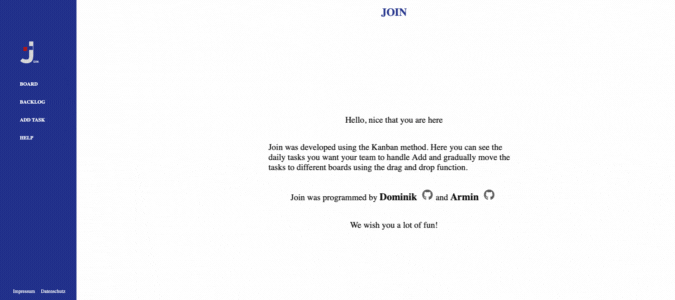
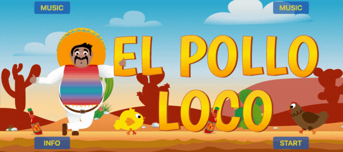

<h1 align="center">Hi there 👋, I'm Dominik</h1>

<h2 align="center">Frontend developer</h2>

* 🧑🏻‍💻 I'm from Swiss 🇨🇭
* 🏗 I love creating new things
* 💻 I build content related to web development
* 🤩 I really enjoy learning languages and frameworks like JS, Angular and as well as work in WordPress.

### Skills and Experience

## Some examples of Work

# Contact me

  

  
